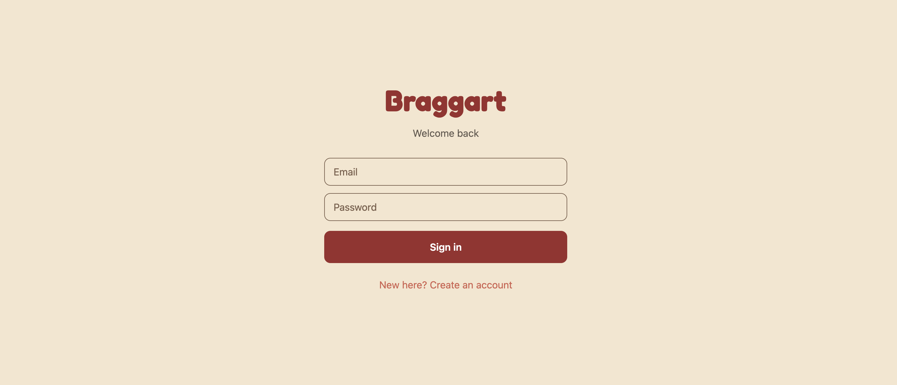
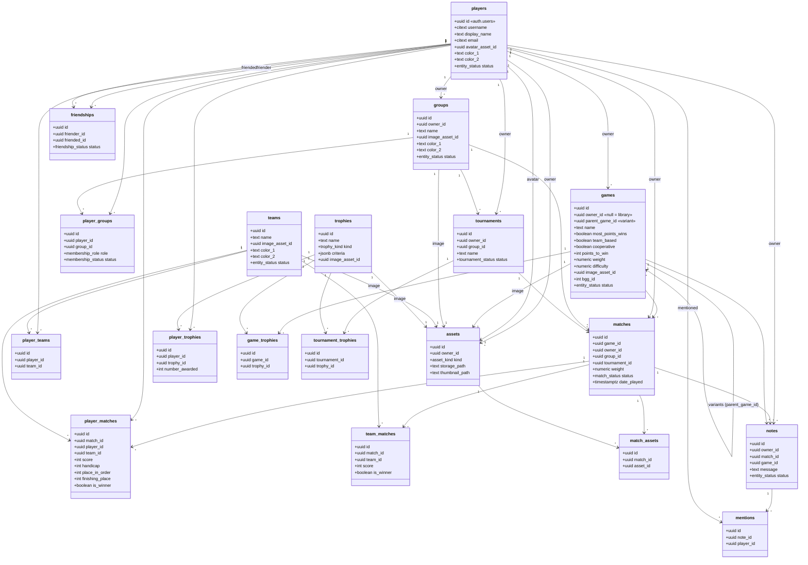

# Braggart

[](https://github.com/tloughrist/braggart/actions/workflows/ci.yml)

Braggart is a cross-platform mobile app for tracking tabletop game statistics
within a group of friends, and for turning that match history into meaningful
player rankings, including principled comparisons between players who have never
actually faced each other.

It is built as a single Expo / React Native codebase targeting iOS, Android, and
web, on a Postgres backend with database-enforced authorization, SQL-computed
statistics, and a rating-plus-graph engine for the rankings.

> Status: personal portfolio project. The app — authentication, groups with
> owner/admin/member roles, match recording and history, tournaments,
> group-scoped statistics, in-app rankings, and profiles with avatar uploads —
> is functional and covered by database tests in CI. Web hosting is defined as
> infrastructure-as-code on AWS and is pending account activation. See
> [Project status](#project-status) and the [development roadmap](docs/roadmap.html).

## Screenshots

Sign-in (light theme):



## What it does

- **Record matches** — individual or team-based, with per-player handicaps and a
  chosen match date. Winners and finishing places are computed on the server
  from the scores, respecting each game's scoring direction (highest or lowest
  wins).
- **Group-scoped leaderboards** — per-game statistics (matches played, wins, win
  rate, average point deviation from the winner) scoped to the currently active
  group.
- **Rankings and head-to-head comparison** — switch a game's leaderboard between
  raw stats, Elo, and Glicko-2, and compare any two players (including ones who
  never met) with an uncertainty-aware win probability and a confidence based on
  how connected they are.
- **Match history** — browse, filter (by game, date range, or players), and sort
  past matches, then open any one for full results. The match's owner or a group
  admin can edit its scores or delete it.
- **Tournaments** — group a set of matches under a named tournament, follow live
  standings, end it when it is done, and delete it (optionally keeping its
  matches as regular ones).
- **Groups and roles** — create groups and switch the active group; all recording
  and stats follow it. Membership has owner, admin, and member roles: any member
  can record matches, while owners and admins also manage members, promote or
  demote admins, and edit or delete the group's matches and tournaments.
- **Profiles** — editable display name, uploadable avatar image, identity colors,
  password, and a personal win/loss summary computed from match history.
- **Fast entry** — type-to-filter search for games and players, so a large
  library stays usable on a phone.
- **Mobile-first and responsive** — one layout that adapts from a narrow phone to
  wide web (for example, a stat table that scrolls horizontally on a phone and
  fills the card on desktop).

## Tech stack

- **Frontend**: Expo, React Native, expo-router, TypeScript. A single codebase
  runs on iOS, Android, and the web.
- **Backend**: Supabase (managed Postgres). The schema, constraints, row-level
  security policies, SQL views, and stored functions are all version-controlled
  as migrations.
- **Data access**: one module, `lib/api.ts`, is the only code that talks to the
  backend client; every screen calls typed domain functions instead. This keeps
  the backend behind a single, replaceable boundary.
- **Infrastructure**: AWS CDK (TypeScript) defines the web hosting stack
  (private S3 bucket behind a CloudFront distribution).

## The ranking system

Braggart's headline feature is comparative player rankings, and specifically the
ability to compare two players who have never played each other directly. It
combines a rating model with a graph model.

**Rating: who is better?** Each player earns a skill rating from match outcomes.
Two systems are implemented:

- **Elo**, the familiar baseline.
- **Glicko-2**, which additionally tracks a *rating deviation* (how uncertain the
  rating is) and a *volatility* (how erratic the player's results are). A player
  with only a couple of games is reported as highly uncertain rather than falsely
  precise.

Because ratings propagate through shared opponents, they are inherently
transitive: if Tim beats Garrett and James repeatedly loses to Garrett, Tim
ranks above James even if the two never met.

**Graph: how comparable are they?** Players are nodes and "has played game X
against" is an edge (derived from shared matches). A recursive traversal measures
how two players are connected: their degrees of separation and their shared
opponents. A comparison drawn through two mutual opponents is more trustworthy
than one drawn through a long, tenuous chain.

**Together.** The rating answers "who is better," and the graph answers "how
confident should we be." For two players who never met, Braggart reports an
uncertainty-aware win probability (from Glicko-2's ratings and deviations)
alongside a confidence that reflects both rating uncertainty and network
distance. Example output from seeded data:

```
Tim 1501 (RD 221)  vs  James 1203 (RD 175)
  win probability:  78%   (uncertainty-aware)
  connectivity:     depth 2 via 2 shared opponents (Barb, Garrett)
```

Tim and James never played, but they are connected through Barb and Garrett, so
the comparison is meaningful, with a confidence tempered by both players' limited
game counts.

**Implementation.** The whole system runs in Postgres, with no separate graph
database. Recursive common table expressions perform the graph traversal, and
Glicko-2 (including its iterative volatility solver) is implemented in plpgsql.
The rating models sit behind a common interface, so additional systems such as
TrueSkill can be added without changing how the rest of the app requests a
ranking. Postgres was chosen over a dedicated graph database deliberately: the
graph is small and bounded, its edges are derived from existing relational data,
and staying in one datastore avoids the operational cost of syncing two.

## Engineering highlights

- **Authorization lives in the database.** Access rules are enforced by Postgres
  row-level security, not only in the client. For example, only a match's owner
  can edit its scores, enforced by an RLS policy rather than application code.
- **Statistics as SQL.** Leaderboards are produced by a security-invoker SQL view
  (`game_player_stats`), so the computation sits next to the data and honors each
  user's row-level permissions automatically.
- **Atomic writes.** Recording a match (a match row plus one row per participant,
  with winner and placement logic) is a single transactional Postgres function,
  so a partial write cannot occur.
- **A replaceable backend boundary.** Because all data access flows through
  `lib/api.ts`, moving from Supabase to a different backend (for instance an AWS
  API Gateway and Lambda service) means reimplementing one module rather than
  touching the UI.
- **Infrastructure as code.** Hosting is defined with AWS CDK rather than console
  clicks, so the environment is reproducible and reviewable.
- **Tested where it matters.** The backend logic (rating math, winner and
  placement computation, the stats view, and the RLS/ownership guards) is covered
  by pgTAP tests run in CI, encoding behavior like "a handicap can flip the
  winner" and "a non-member cannot read a group's rankings."

## Project status

- **Built and functional**: authentication with session handling, groups and
  membership with owner/admin/member roles, match recording (individual and team,
  with handicaps and dates), match history with detail/edit/delete plus filtering
  and sorting, tournaments (grouping matches, standings, end and delete),
  group-scoped per-game leaderboards, the ranking engine in-app (Elo and Glicko-2
  leaderboards plus a networked compare-players view), profiles with avatar image
  upload, searchable pickers, and a mobile-first responsive UI, all behind
  row-level security and the `lib/api.ts` data-access layer, with pgTAP tests in
  CI.
- **In progress**: AWS web deployment. The CDK stack synthesizes cleanly and is
  awaiting AWS account activation.
- **Planned**: a recognition layer (trophy and award UI over the already-modeled
  tables, with default art assets), the social graph (friendships, persistent
  teams, session notes, mentions), structured tournaments (brackets, seeding,
  rounds), and convention-scale onboarding (self-service join codes and
  large-group support). The schema already anticipates much of this. See the
  [development roadmap](docs/roadmap.html) for the phased plan.

## Data model

The schema is defined in `supabase/migrations/`. The diagram below reflects the
as-built structure. A few deliberate modeling choices:

- Credentials live in Supabase's `auth.users`; `players` is the public profile,
  keyed one-to-one to the auth user.
- Images live in object storage; a single `assets` table (full image plus an
  optional thumbnail path) is referenced by the entities that need one.
- Game variants are modeled as a game with a `parent_game_id` self-reference
  rather than a separate table.
- Lifecycle and soft-delete use typed enums (`entity_status`, `match_status`,
  `tournament_status`, `friendship_status`, `membership_status`) instead of
  free-text state columns.

<details>
<summary>Entity-relationship diagram (19 tables)</summary>



</details>
