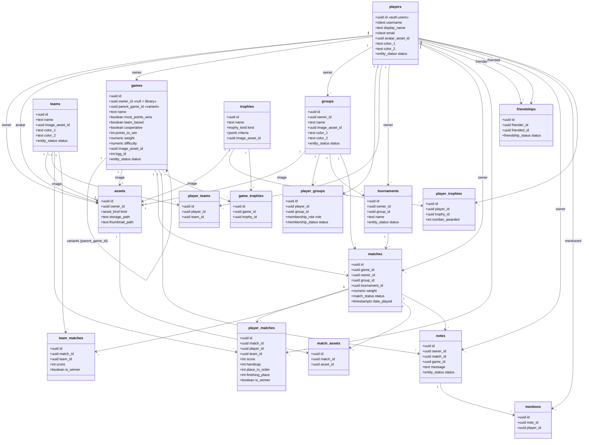

# braggart

## Purpose
- Keep track of tabletop game statistics among your friends.

## Features
- Profile
	- Login/persistent account
	- Change display name
	- Change password
	- Change profile picture
	- Display stats
	- Select primary and secondary colors
- Games
	- Large preset game library (big time suck here) - unless there's a way to scrape and process BGG's library
	- Add new games locally
	- Edit games locally
	- Delete games locally
	- Display personal game stats
	- For games in the universal library, display global stats (?? Do we want to do this? Or do we just want this for local groups? This would be a hard feature to add later.)
	- Set win conditions and weights for local games
	- Create a local copy of a game from the universal library
	- Change thumbnail picture for local games
	- Variants
- Matches
	- Create match
	- Add players
	- Randomly select first player
	- Assign order of play (optional)
	- Edit date of match
	- Edit match notes
	- Match is owned by a single player
	- Owner and only owner can edit scores
	- Add handicaps to players for the match
	- Add pictures from the session
- Groups
- Friendships
- Teams
- Notes
	- Mentions
- Trophies
- Stats
	- This is the primary feature of the app
	- Various statistics are collected from every match
	- Different statistical models can be applied to provide rankings within a group

?? NETWORK RANKINGS: Do we only want to compare within a group? Imagine that Tim and James are both in group A and both in group B. Both groups play Settlers of Catan. If Tim wants to know whether he's a better player than James, should it only be T>J wrt A or should there be an option to compare Tim and James simpliciter? What if Tim and James have never played each other, but they've both played Sandy...should we use their stats relative to Sandy to establish a ranking between Tim and James? Perhaps include a "Networked Ranking" toggle. How far out should the network extend? Certainly no more than seven degrees of separation. How would that even be determined?
- A **friends_of_friends** association for each player, perhaps
- Friends of the friends of the friends of the friends of the friends of the friends of the friends of the player -- this would be a huge query...any way to make it more efficient?
- We want friends_of_friends limited to those who have played Settlers of Catan against each other
	- Sa|b: a has played settlers of catan with b
	- fof = []
	- fof << x where Sx|tim
	- fof << x where Sx|y where y is any member of fof
	- FOR0: Tim
	- FOF1: All those who have played soc with Tim
	- FOF2: Anyone who has played soc with those in FOF1 who are not themselves in FOF1 nor FOF0
	- FOF3: Anyone who has played soc with those in FOF2 who are not themselves in FOF2 nor FOF1 nor FOF0
- Call these fof_soc
- We want the intersection of Tim's fof_soc and James' fof_soc
- better_than rankings or this_much_better_than rankings?

This diagram reflects the **as-built schema** in
`supabase/migrations/0001_initial_schema.sql`. Notes:

- Credentials (password, auth) live in Supabase's `auth.users`; `players` is the
  public profile, keyed 1:1 to the auth user.
- Images live in Supabase Storage; the single `assets` table (full image +
  optional `thumbnail_path`) replaces the old Thumbnails/Assets split.
- Variants are modeled as a game with a `parent_game_id` self-reference rather
  than a separate table.
- Lifecycle/soft-delete uses typed enums (`entity_status`, `match_status`,
  `friendship_status`, `membership_status`) instead of free-text `state`.

